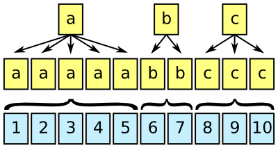
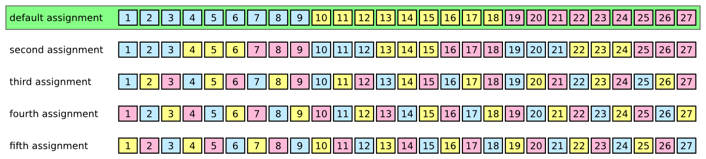
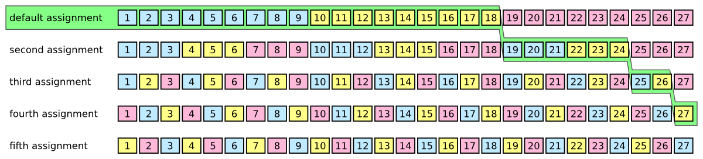
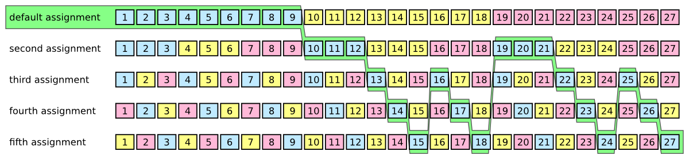

# Femtocode

## Introduction

Femtocode is a language and a system to support fast queries on structured data, such as high-energy physics data.

The goal of this project is to replace the practice of copying and reducing a centrally produced dataset with direct queries on that dataset. Currently, high-energy physicists write programs to extract the attributes and data records of interest— personally managing the storage and versioning of that private copy— just to make plots from the subset in real time. Femtocode will allow users to make plots from the original dataset in real time, which may be as large as petabytes.

Femtocode makes this possible by introducing a novel translation of query semantics into pure array operations, which strips away all unnecessary work at runtime. By dramatically reducing the computation time, the only bottleneck left is the data transfer, so caching is also heavily used to minimize the impact of repeated and similar queries.

This project is at an early stage of its development, though it is past the feasibility studies and basic implementation. End-to-end demonstrations will be possible by the end of April and usable prototypes will be available sometime in the summer of 2017.

## Installation

Don’t bother yet. See above.

## Query language motivation

Femtocode was inspired by fast SQL services that translate users’ requests into operations with the same meaning as the their queries, yet are much faster than naive interpretations of them. The ability to perform these translations is helped by the fact that SQL minimally constrains the computation: there are no “for” loops to specify an order of iteration, no mutable variables, etc. The language is fast _because_ it is high-level, rather than in spite of being high-level.

At first, it would seem that SQL would be ideal for the first phase of every high-energy physics analysis: reducing huge sets of data points into distributions (histograms). But in their original form, these “data points” are structured collections of events containing jets containing tracks containing hits, all arbitrary-length lists of multi-field records. As a language, SQL does not express explode-operate-recombine tasks easily and most SQL implementations cannot evaluate them without expensive joins.

Femtocode generalizes the SELECT and WHERE parts of SQL by adding explode-operate-recombine semantics in a functional syntax. For instance, given data structured as `events >> jets >> tracks`,

    jets.map(j => j.tracks.filter(t => t.pt > 5).sum).max

would find the jet with the largest sum-of-pt for pt > 5 tracks within the jet. There would be no more than one result per event (zero if the event had no jets to start with). To do this in SQL would require assigning indexes, exploding, and then expensive joins to get one result per event. And yet it is typical of a physicist’s search through petabytes of data.

## Query Language details

To suit this application and others like it, Femtocode is

   * **declarative:** the written order of expressions is not necessarily the order evaluated,
   * **functional:** functions are objects with no side-effect generating loops or mutable variables,
   * **statically typed:** types must be understood before execution, though they are inferred from the input data types, rather than denoted explicitly,
   * **non-recursive:** no unbounded loops or infinite data are allowed,
   * **vectorizable:** the above is sufficient to allow code translations that can pipeline and vectorize similar operations, and
   * **without runtime errors:** all possible errors are caught by static analysis.

Furthermore, Femtocode’s syntax is as similar as possible to Python. Python expressions (not statements) are syntactically valid Femtocode, and Femtocode adds a more convenient lambda syntax ([see grammar](lang/generate-grammar/femtocode.g)).

Within this playground, any single-pass algorithm can be written that does not include unbounded loops: less powerful than Turing completeness but more powerful than strict SQL SELECT-WHERE. These algorithms can then be translated into sequences of operations on “shredded” data, data structures that have been flattened into featureless arrays. Rather than operating on data whose layout in memory resembles the conceptual task (e.g. all attributes of a jet together), the layout is organized for speed of access (e.g. all jet attribute `x` in one array, jet attribute `y` in another).

(See [this blog post](http://blog.twitter.com/2013/dremel-made-simple-with-parquet) for a description of shredding in Parquet. Femtocode has a slightly different shredding algorithm and performs all calculations in the shredded form, rather than just using it for efficient storage.)

Within Femtocode’s restrictions, there are only three kinds of operations: explode, flat, and combine.

#### Explode operations



An array representing an attribute at one level of structure, such as one value per event, is brought in line with another array representing a different level of structure, such as one value per jet.

This can be accomplished by copying values from the first array or by moving two indexes at different rates.

#### Flat operations


Two or more arrays have the same level of structure, and can therefore be operated upon element-by-element. This case corresponds to [Numpy’s “universal functions”](http://docs.scipy.org/doc/numpy/reference/ufuncs.html) or ufuncs.

Splitting loops appropriately would allow for automatic vectorization in this case, and any function adhering to the Numpy ufunc specification could be included in the language.

#### Combine operations


An array at one level of structure is reduced to a lower level of structure by computing the sum, maximum, minimum, etc. per group.

Thus, the Femtocode example

    jets.map(j => j.tracks.filter(t => t.pt > cut).sum).max

translates into

   1. Take a `cut` variable (one per event) and associate each `t.pt` value to the appropriate one (explode).
   2. Mask `t.pt` values that are greater than `cut` (flat).
   3. Compute their sum, one per jet (combine).
   4. Find the maximal jet by this measure (another combine).

Columnar operations like these can be performed considerably faster than constructing jet objects containing variable-length track collections, executing the literal code, and then deleting these objects before moving on to the next event.

In our tests, columnar operations can be performed at a rate of billions per second, mostly sensitive to hardware memory bandwidth.


Amusingly, this is about the rate at which high-energy physics collisions occur in modern colliders. These events are, however, filtered by many orders of magnitude during data acquisition, so a query system that can analyze a billion events per second would be able to plot several year’s worth of data “instantly.”

## Workflow structure

Femtocode is not and will not be a complete language in the same sense as Python or C++. The restriction on recursion and other forms of unbounded looping limit its applicability for general programming.

The intended use of Femtocode is similar to that of SQL snippets within an application, regular expressions, or ROOT’s `TTree::Draw` (familiar to physicists). It appears in quoted blocks like this (from current unit tests):

```python
session = RemoteSession("http://testserver:8080")

pending = session.source("xy-dataset")
                 .define(z = "x + y")
                 .toPython("Result", a = "z - 3", b = "z - 0.5")
                 .submit()

result = result.await()
for x in result:
    print x
```

or this (someday):

```python
workflow = session.source("b-physics")                   # pull from a named dataset
       .define(goodmuons = "muons.filter($1.pt > 5)")    # muons with pt > 5 are good
       .filter("goodmuons.size >= 2")                    # keep events with at least two
       .define(dimuon = """
           mu1, mu2 = goodmuons.maxby($1.pt, 2);         # pick the top two by pt
           energy = mu1.E + mu2.E;                       # compute combined energy/momentum
           px = mu1.px + mu2.px;
           py = mu1.py + mu2.py;
           pz = mu1.pz + mu2.pz;

           rec(mass = sqrt(energy**2 - px**2 - py**2 - pz**2),
               pt = sqrt(px**2 + py**2),
               phi = atan2(py, px),
               eta = ln((energy + pz)/(energy - pz))/2)  # construct a record as output
           """)
       .bundle(                                          # make a bundle of plots
           mass = bin(120, 0, 12, "dimuon.mass"),        # using the variables we’ve made
           pt = bin(100, 0, 100, "dimuon.pt"),
           eta = bin(100, -5, 5, "dimuon.eta"),
           phi = bin(314, 0, 2*pi, "dimuon.phi + pi"),
           muons = foreach("goodmuons", "mu", bundle(    # also make plots with one muon per entry
               pt = bin(100, 0, 100, "mu.pt"),
               eta = bin(100, -5, 5, "mu.eta"),
               phi = bin(314, -pi, pi, "mu.phi")
           ))
       )

pending = workflow.submit()                              # submit the query
pending["mass"].plot()                                   # and plot results while they accumulate
pending["muons"]["pt"].plot()                            # (they’ll be animated)

blocking = pending.await()                               # stop the code until the result is in

massplot = blocking.plot.root("mass")                    # convert to a familiar format, like ROOT
massplot.Fit("gaus")                                     # and use that package’s tools
```

A workflow describes a chain of operations to perform on the source data, ending with some sort of aggregation. The chain is strictly linear up to the aggregation step, which then branches into a tree. The aggregation step uses concepts and code from the [Histogrammar project](http://github.com/histogrammar/histogrammar-python).

Each workflow is submitted as a query to a query engine (single process or distributed server), which immediately returns a “future” object. This object monitors the progress of the query, even plotting partial results (histograms fill up with entries) so that the user can decide to cancel early.

_Why linear, and not a full directed acyclic graph (DAG)?_ DAGs are good for two things: splitting the output and explicitly short-circuting some processes to avoid unnecessary work. In our case, the aggregation step is a general tree, providing multiple outputs, so this capability is covered. As for avoiding unnecessary work, the columnar nature of the calculation undermines our ability to make per-event choices about work, and the Femtocode compilation process uses the language’s perfect referential transparency to automatically avoid calculating repeated subexpressions. Thus, full DAGs aren’t necessary.

_What about skims for unbinned fits or machine learning?_ The feasibility of the above depends on the returned results being much smaller than the input datasets, as a histogram of dimuon mass is much smaller than a collection of muon records. However, some analysis techniques need unaggregated data. They must be treated specially— for instance, the returned result would be a pointer to a remote disk on which the full skim is located.

Although we still envision the necessity of making private skims of the data for these purposes, the user’s behavior could be turned from skim-first, plot-later to plot-first, skim-later, reducing the chance of mistakes that would require re-skims.

## Eliminating runtime errors

One of the bullet points describing Femtocode (above) claims that runtime errors will be eliminated. This is desirable because it allows us to drop error-checking code at runtime (a speed bump to numerical math), because it wastes fewer resources (the shared query server isn’t preoccupied by faulty code), and because it provides quicker feedback to the data analyst about unhandled special cases.

Eliminating runtime errors is possible because mutable state and unbounded loops are excluded (Femtocode is a [“total functional language”](http://lambda-the-ultimate.org/node/2003)) and because Femtocode has a “fine grained” type system. Beyond the basic types— boolean, integer, real, string, array, record, and union (for nullable types and sum types)— Femtocode’s type system specifies numerical ranges on its number types and array sizes.

Thus, one variable describing angles might be typed as

```
real(min=-pi, max=pi)
```

while another is typed as

```
real(min=0, max=2*pi)
```

and it is useful for the data analyst to know the difference. Similarly, our dimuon example (above) is valid only because

```
mu1, mu2 = goodmuons.maxby($1.pt, 2)
```

comes after

```
.filter("goodmuons.size >= 2")
```

This ensures that the type of `goodmuons` is an array with at least two elements. In Python, the assignment would raise an exception on some rare event, rather than immediately (or at all).

In general, data types should be thought of as spaces that can be sliced up in various ways, and type-checking should be thought of as a special case of theorem proving.

Here is working code that demonstrates the use of fine-grained types. Unrestrained division is not allowed

```python
source = session.source("Test", x=real, y=real)
source.type("x / y")
```

because it sometimes leads to indeterminate forms. (Floating point infinities are allowed, but we have chosen to exclude `NaN` values because they propagate in non-intuitive ways.)

```
FemtocodeError: Function "/" does not accept arguments with the given types:

    /(integer,
      real)

    Indeterminate form (0 / 0) is possible; constrain with if-else.

Check line:col 1:0 (pos 0):

    x / y
----^
```

This error message tells the user about the special case and suggests the following replacement:

```python
source.type("if y != 0: x / y else: None")
```

Now the type is meaningful.

```
union(null, real)
```

(This is a nullable real, a value that could be real or missing. It is a type-safe replacement for `NaN` because it would not be accepted by functions that take a pure number as input, such as `sin` and `sqrt`, similar to the [type-safe null](http://www.lucidchart.com/techblog/2015/08/31/the-worst-mistake-of-computer-science/) of Haskell and Scala.)

## Fast execution

The entirety of the Femtocode compiler is written in pure Python for maximum portability (only the standard libraries; works in Jython). However, a pure Python runtime engine would seriously compromise execution speed.

Fast execution is based on two external libraries: [Numpy](http://www.numpy.org/) and [Numba](http://numba.pydata.org/). Numpy is a well-known array toolkit, allowing us to place data contiguously in memory, and Numba is a just-in-time compiler that relies on the [LLVM toolkit](http://llvm.org/). Both can be installed with [Conda](http://conda.io/docs/).

Femtocode is compiled in the following steps:

   1. Femtocode snippets in a workflow are parsed, analyzed, and type-checked.
   2. Code is translated into a sequence of explode, flat, and combine statements.
   3. These statements are bound into a query object that is sent to the server as JSON.
   4. The query server builds dependency graphs among the statements to decide which to combine into loops.
   5. Loops are compiled into Python bytecode.
   6. Numba translates Python bytecode into LLVM intermediate representation and compiles that to native bytecode.
   7. Native bytecode is executed on Numpy arrays.

This breakdown improves modularity: steps 1–3 do not require external libraries, so the end-user’s software can be free of dependencies. Step 4 is an optimization that may require tweaking, so it is performed on the server that we control. (Old client versions do not limit the system’s performance.) Step 5 sounds extraneous— converting to Python bytecode before converting to LLVM/native bytecode— however, it is the language Numba understands and the Python bytecode allows us to run unit tests without LLVM compilation.

On distributed servers (discussed in detail below), there is an additional step: native bytecode is compiled once on a machine that sees the whole query and then is transmitted to worker nodes that each perform a subtask. Deserializing a function (2 ms) is considerably faster than compiling one (at least 96 ms, depending on complexity).

### Loop generation

Step 4, building loops, requires special attention. This is an optimization that compilers normally wouldn’t be allowed to make: different choices lead to considerably different memory usage and side-effects. However, these concepts are not visible in Femtocode, so they can be tuned for performance.

To illustrate this choice, consider the following expression, which has a reasonably complex dependency graph.

```
((((((a + b) – (c + d)) + (e + f)) – ((c + d) – ((a + b) – (c + d)))) +
  (((a + b) – (c + d)) + (e + f))) + ((c + d) + (e + f)))
```

Each of the variables, `a`, `b`, `c`, `d`, `e`, `f`, are represented by large (equal-length) arrays, and the goal is to compute the above expression for each element `i`.

The simplest way to generate code would be to put all operations into a single array, like this:


The “Numpy way” is to put each operation into its own array (because Numpy does not have a just-in-time compiler), like this:


However, the ideal case may be somewhere between the two. In this _purely illustrative example,_ we wrote an algorithm to isolate subractions (or the end goal) at the end of each loop:


These examples differ greatly in the memory footprint: the first introduces 1 temporary array, the second introduces 10 temporary arrays, and the third introduces 4 temporary arrays. Each array is as large as the input (megabytes, at least).

Perhaps more importantly, they differ in the memory bandwidth required. The first example requires 1 pass over 7 memory regions simultaneously, the second requires 10 passes over 2 memory regions each, and the third requires 4 passes over as few as 4 and as many as 7 memory regions. The bottleneck for simple calculations is memory bandwidth, so fewer passes is better. But if one of the passes must touch so many memory regions that the CPU cache swaps, the benefit of removing passes is lost.

Vectorization and pipelining of CPU instructions are another consideration. Compilers like LLVM can do this automatically, but only if the structure of the loop is sufficiently homogeneous.

Finally, the structure of the user’s query applies some hard constraints: if a user wants to perform a calculation over two nested collections, say muons and jets, these _cannot_ be in the same loop because they have different lengths.

For now, we are setting a policy of making the loop as large as possible (fewest passes), given the query constraints. However, we foresee this to be an area of future research.

## Modular data sources

Since calculations are performed on Numpy arrays, Numpy is a natural choice for data storage. Data in `.npy` files can be lifted directly from disk into memory, and `.npz` files additionally provide compression.

However, a variety of columnar data formats are available, including [Parquet](http://parquet.apache.org), [Feather](http://wesmckinney.com/blog/feather-its-the-metadata/), [HDF5](http://support.hdfgroup.org/HDF5/), and [ROOT](http://root.cern.ch). ROOT is a particularly good choice because the majority of high-energy physics data are already stored in this form. However, ROOT’s “splitting” (shredding) algorithm does not store variable length lists within variable length lists in a columnar way, so only a subset of Femtocode’s type system can be encoded within it.

Also, we wish to consider the possibility of storing data in a database, rather than files, so we are experimenting with BLOB storage in [CouchBase](http://www.couchbase.com/).

To support these backends, we have implemented a neutral API that allows optimized reads from each of them.

**Currently implemented:**

   * Numpy files (`.npz`, with or without compression), locally or through XRootD
   * ROOT files, using any method available to ROOT, including XRootD
   * CouchBase database, via HTTP

## Query server

Although memory bandwidth is the bottleneck for GHz-scale computation (see KNL plot, above), reading files or a database from disk or the network is a MHz-scale bottleneck. A query server would need a large in-memory cache to be effective: this would allow frequently used data to be accessed quickly, while rarely used data would be slower.

Terabyte-scale caches can be built by combining the resources of a computer cluster (e.g. 20 machines with 50 GB of memory each). A terabyte can hold 140 floating point variables for a billion-event dataset. (These are all conservative numbers.) So while caching data for a typical analysis might not be feasible on a laptop, it’s easily possible for a cluster, and most users of that cluster would share cache because they’re analyzing the same input data.









