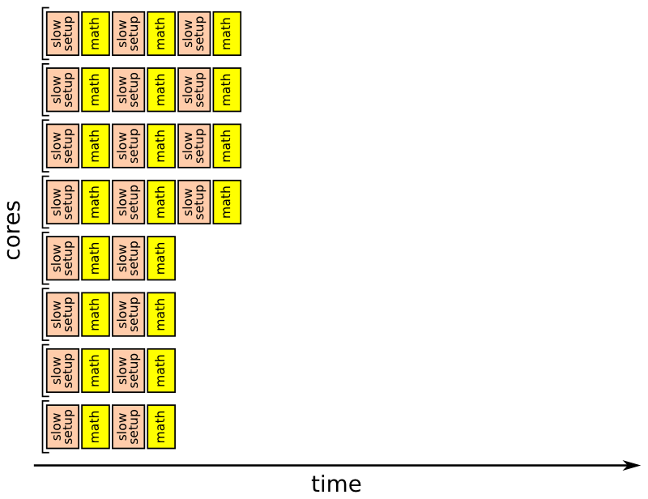

# Femtocode

## Introduction

Femtocode is a language and a system to support fast queries on structured data, such as high-energy physics data.

The goal of this project is to replace the practice of copying and reducing a centrally produced dataset with direct queries on that dataset. Currently, high-energy physicists write programs to extract the attributes and data records of interest— personally managing the storage and versioning of that private copy— just to make plots from the subset in real time. Femtocode will allow users to make plots from the original dataset in real time, which may be as large as petabytes.

Femtocode makes this possible by introducing a novel translation of query semantics into pure array operations, which strips away all unnecessary work at runtime. By dramatically reducing the computation time, the only bottleneck left is the data transfer, so caching is also heavily used to minimize the impact of repeated and similar queries.

This project is at an early stage of its development, though it is past the feasibility studies and basic implementation. End-to-end demonstrations will be possible by the end of April and usable prototypes will be available sometime in the summer of 2017.

## Installation

Don’t bother yet. See above.

But... if you want to try it anyway, note that this repository contains five Python packages with `setup.py` files:

   * **lang:** the base package and client (no dependencies),
   * **numpyio:** back-end for reading Numpy files as a data source (depends on base femtocode, ruamel.yaml, and Numpy),
   * **rootio:** back-end for reading ROOT files as a data source (depends on base femtocode, ruamel.yaml, Numpy, and ROOT),
   * **run:** compiles Femtocode to native bytecode and manages computation; the Standalone Engine (described below) is contained in this package (depends on base femtocode, femtocode-numpyio, Numba, and Numpy),
   * **server:** performs distributed calculations as a production query server (depends on base femtocode, femtocode-run, and pymongo).

Installing all of them (`python setup.py install --user`) from top to bottom in this list would satisfy the dependency order.

(There might be local file paths in the unit tests, making them inoperable on your computer.)

## Query language motivation

Femtocode was inspired by fast SQL services that translate users’ requests into operations with the same meaning as the their queries, yet are much faster than naive interpretations of them. The ability to perform these translations is helped by the fact that SQL minimally constrains the computation: there are no “for” loops to specify an order of iteration, no mutable variables, etc. The language is fast _because_ it is high-level, rather than in spite of being high-level.

At first, it would seem that SQL would be ideal for the first phase of every high-energy physics analysis: reducing huge sets of data points into distributions (histograms). But in their original form, these “data points” are structured collections of events containing jets containing tracks containing hits, all arbitrary-length lists of multi-field records. As a language, SQL does not express explode-operate-recombine tasks easily and most SQL implementations cannot evaluate them without expensive joins.

Femtocode generalizes the SELECT and WHERE parts of SQL by adding explode-operate-recombine semantics in a functional syntax. For instance, given data structured as `events >> jets >> tracks`,

    jets.map(j => j.tracks.filter(t => t.pt > 5).sum).max

would find the jet with the largest sum-of-pt for pt > 5 tracks within the jet. There would be no more than one result per event (zero if the event had no jets to start with). To do this in SQL would require assigning indexes, exploding, and then expensive joins to get one result per event. And yet it is typical of a physicist’s search through petabytes of data.

## Query Language details

To suit this application and others like it, Femtocode is

   * **declarative:** the written order of expressions is not necessarily the order evaluated,
   * **functional:** functions are objects with no side-effect generating loops or mutable variables,
   * **statically typed:** types must be understood before execution, though they are inferred from the input data types, rather than denoted explicitly,
   * **non-recursive:** no unbounded loops or infinite data are allowed,
   * **vectorizable:** the above is sufficient to allow code translations that can pipeline and vectorize similar operations, and
   * **without runtime errors:** all possible errors are caught by static analysis.

Furthermore, Femtocode’s syntax is as similar as possible to Python. Python expressions (not statements) are syntactically valid Femtocode, and Femtocode adds a more convenient lambda syntax ([see grammar](lang/generate-grammar/femtocode.g)).

Within this playground, any single-pass algorithm can be written that does not include unbounded loops: less powerful than Turing completeness but more powerful than strict SQL SELECT-WHERE. These algorithms can then be translated into sequences of operations on “shredded” data, data structures that have been flattened into featureless arrays. Rather than operating on data whose layout in memory resembles the conceptual task (e.g. all attributes of a jet together), the layout is organized for speed of access (e.g. all jet attribute `x` in one array, jet attribute `y` in another).

(See [this blog post](http://blog.twitter.com/2013/dremel-made-simple-with-parquet) for a description of shredding in Parquet. Femtocode has a slightly different shredding algorithm and performs all calculations in the shredded form, rather than just using it for efficient storage.)

Within Femtocode’s restrictions, there are only three kinds of operations: explode, flat, and combine.

#### Explode operations


An array representing an attribute at one level of structure, such as one value per event, is brought in line with another array representing a different level of structure, such as one value per jet.

This can be accomplished by copying values from the first array or by moving two indexes at different rates.

#### Flat operations


Two or more arrays have the same level of structure, and can therefore be operated upon element-by-element. This case corresponds to [Numpy’s “universal functions”](http://docs.scipy.org/doc/numpy/reference/ufuncs.html) or ufuncs.

Splitting loops appropriately would allow for automatic vectorization in this case, and any function adhering to the Numpy ufunc specification could be included in the language.

#### Combine operations


An array at one level of structure is reduced to a lower level of structure by computing the sum, maximum, minimum, etc. per group.

Thus, the Femtocode example

    jets.map(j => j.tracks.filter(t => t.pt > cut).sum).max

translates into

   1. Take a `cut` variable (one per event) and associate each `t.pt` value to the appropriate one (explode).
   2. Mask `t.pt` values that are greater than `cut` (flat).
   3. Compute their sum, one per jet (combine).
   4. Find the maximal jet by this measure (another combine).

Columnar operations like these can be performed considerably faster than constructing jet objects containing variable-length track collections, executing the literal code, and then deleting these objects before moving on to the next event.

In our tests, columnar operations can be performed at a rate of billions per second, mostly sensitive to hardware memory bandwidth.


Amusingly, this is about the rate at which high-energy physics collisions occur in modern colliders. These events are, however, filtered by many orders of magnitude during data acquisition, so a query system that can analyze a billion events per second would be able to plot several year’s worth of data “instantly.”

## Workflow structure

Femtocode is not and will not be a complete language in the same sense as Python or C++. The restriction on recursion and other forms of unbounded looping limit its applicability for general programming.

The intended use of Femtocode is similar to that of SQL snippets within an application, regular expressions, or ROOT’s `TTree::Draw` (familiar to physicists). It appears in quoted blocks like this (from current unit tests):

```python
session = RemoteSession("http://testserver:8080")

pending = session.source("xy-dataset")
                 .define(z = "x + y")
                 .toPython("Result", a = "z - 3", b = "z - 0.5")
                 .submit()

result = result.await()
for x in result:
    print x
```

or this (someday):

```python
workflow = session.source("b-physics")                   # pull from a named dataset
       .define(goodmuons = "muons.filter($1.pt > 5)")    # muons with pt > 5 are good
       .filter("goodmuons.size >= 2")                    # keep events with at least two
       .define(dimuon = """
           mu1, mu2 = goodmuons.maxby($1.pt, 2);         # pick the top two by pt
           energy = mu1.E + mu2.E;                       # compute combined energy/momentum
           px = mu1.px + mu2.px;
           py = mu1.py + mu2.py;
           pz = mu1.pz + mu2.pz;

           rec(mass = sqrt(energy**2 - px**2 - py**2 - pz**2),
               pt = sqrt(px**2 + py**2),
               phi = atan2(py, px),
               eta = ln((energy + pz)/(energy - pz))/2)  # construct a record as output
           """)
       .bundle(                                          # make a bundle of plots
           mass = bin(120, 0, 12, "dimuon.mass"),        # using the variables we’ve made
           pt = bin(100, 0, 100, "dimuon.pt"),
           eta = bin(100, -5, 5, "dimuon.eta"),
           phi = bin(314, 0, 2*pi, "dimuon.phi + pi"),
           muons = foreach("goodmuons", "mu", bundle(    # also make plots with one muon per entry
               pt = bin(100, 0, 100, "mu.pt"),
               eta = bin(100, -5, 5, "mu.eta"),
               phi = bin(314, -pi, pi, "mu.phi")
           ))
       )

pending = workflow.submit()                              # submit the query
pending["mass"].plot()                                   # and plot results while they accumulate
pending["muons"]["pt"].plot()                            # (they’ll be animated)

blocking = pending.await()                               # stop the code until the result is in

massplot = blocking.plot.root("mass")                    # convert to a familiar format, like ROOT
massplot.Fit("gaus")                                     # and use that package’s tools
```

A workflow describes a chain of operations to perform on the source data, ending with some sort of aggregation. The chain is strictly linear up to the aggregation step, which then branches into a tree. The aggregation step uses concepts and code from the [Histogrammar project](http://github.com/histogrammar/histogrammar-python).

Each workflow is submitted as a query to a query engine (single process or distributed server), which immediately returns a “future” object. This object monitors the progress of the query, even plotting partial results (histograms fill up with entries) so that the user can decide to cancel early.

_Why linear, and not a full directed acyclic graph (DAG)?_ DAGs are good for two things: splitting the output and explicitly short-circuting some processes to avoid unnecessary work. In our case, the aggregation step is a general tree, providing multiple outputs, so this capability is covered. As for avoiding unnecessary work, the columnar nature of the calculation undermines our ability to make per-event choices about work, and the Femtocode compilation process uses the language’s perfect referential transparency to automatically avoid calculating repeated subexpressions. Thus, full DAGs aren’t necessary.

_What about skims for unbinned fits or machine learning?_ The feasibility of the above depends on the returned results being much smaller than the input datasets, as a histogram of dimuon mass is much smaller than a collection of muon records. However, some analysis techniques need unaggregated data. They must be treated specially— for instance, the returned result would be a pointer to a remote disk on which the full skim is located.

Although we still envision the necessity of making private skims of the data for these purposes, the user’s behavior could be turned from skim-first, plot-later to plot-first, skim-later, reducing the chance of mistakes that would require re-skims.

## Eliminating runtime errors

One of the bullet points describing Femtocode (above) claims that runtime errors will be eliminated. This is desirable because it allows us to drop error-checking code at runtime (a speed bump to numerical math), because it wastes fewer resources (the shared query server isn’t preoccupied by faulty code), and because it provides quicker feedback to the data analyst about unhandled special cases.

Eliminating runtime errors is possible because mutable state and unbounded loops are excluded (Femtocode is a [“total functional language”](http://lambda-the-ultimate.org/node/2003)) and because Femtocode has a “fine grained” type system. Beyond the basic types— boolean, integer, real, string, array, record, and union (for nullable types and sum types)— Femtocode’s type system specifies numerical ranges on its number types and array sizes.

Thus, one variable describing angles might be typed as
`real(min=-pi, max=pi)` while another is typed as `real(min=0, max=2*pi)`. It is useful for the data analyst to know the difference.

Our dimuon example (above) is valid only because

```python
filter("goodmuons.size >= 2")
```

comes before

```
mu1, mu2 = goodmuons.maxby($1.pt, 2)
```

This ensures that the type of `goodmuons` is an array with at least two elements. In Python, a faulty assignment would raise an exception on some rare event, rather than immediately (or at all).

In general, data types should be thought of as spaces that can be sliced up in various ways, and type-checking should be thought of as a special case of theorem proving.

Here is working code that demonstrates the use of fine-grained types. Unrestrained division is not allowed

```python
source = session.source("Test", x=real, y=real)
source.type("x / y")
```
```
FemtocodeError: Function "/" does not accept arguments with the given types:

    /(integer,
      real)

    Indeterminate form (0 / 0) is possible; constrain with if-else.

Check line:col 1:0 (pos 0):

    x / y
----^
```

because it sometimes leads to indeterminate forms. (Floating point infinities are allowed, but we have chosen to exclude `NaN` values because they propagate in non-intuitive ways.)

This error message tells the user about the special case and suggests the following replacement:

```python
source.type("if y != 0: x / y else: None")
```

Now the type is meaningful.

```
union(null, real)
```

(This is a nullable real, a value that could be real or missing. It is a type-safe replacement for `NaN` because it would not be accepted by functions that take a pure number as input, such as `sin` and `sqrt`, similar to the [type-safe null](http://www.lucidchart.com/techblog/2015/08/31/the-worst-mistake-of-computer-science/) of Haskell and Scala.)

## Fast execution

The entirety of the Femtocode compiler is written in pure Python for maximum portability (only the standard libraries; works in Jython). However, a pure Python runtime engine would seriously compromise execution speed.

Fast execution is based on two external libraries: [Numpy](http://www.numpy.org/) and [Numba](http://numba.pydata.org/). Numpy is a well-known array toolkit, allowing us to place data contiguously in memory, and Numba is a just-in-time compiler that relies on the [LLVM toolkit](http://llvm.org/). Both can be installed with [Conda](http://conda.io/docs/).

Femtocode is compiled in the following steps:

   1. Femtocode snippets in a workflow are parsed, analyzed, and type-checked.
   2. Code is translated into a sequence of explode, flat, and combine statements.
   3. These statements are bound into a query object that is sent to the server as JSON.
   4. The query server builds dependency graphs among the statements to decide which to combine into loops.
   5. Loops are compiled into Python bytecode.
   6. Numba translates Python bytecode into LLVM intermediate representation and compiles that to native bytecode.
   7. Native bytecode is executed on Numpy arrays.

This breakdown improves modularity: steps 1–3 do not require external libraries, so the end-user’s software can be free of dependencies. Step 4 is an optimization that may require tweaking, so it is performed on the server that we control. (Old client versions do not limit the system’s performance.) Step 5 sounds extraneous— converting to Python bytecode before converting to LLVM/native bytecode— however, it is the language Numba understands and the Python bytecode allows us to run unit tests without LLVM compilation.

On distributed servers (discussed in detail below), there is an additional step: native bytecode is compiled once on a machine that sees the whole query and then is transmitted to worker nodes that each perform a subtask. Deserializing a function (2 ms) is considerably faster than compiling one (at least 96 ms, depending on complexity).

### Loop generation

Step 4, building loops, requires special attention. This is an optimization that compilers normally wouldn’t be allowed to make: different choices lead to considerably different memory usage and side-effects. However, these concepts are not visible in Femtocode, so they can be tuned for performance.

To illustrate this choice, consider the following expression, which has a reasonably complex dependency graph.

```
((((((a + b) – (c + d)) + (e + f)) – ((c + d) – ((a + b) – (c + d)))) +
  (((a + b) – (c + d)) + (e + f))) + ((c + d) + (e + f)))
```

Each of the variables, `a`, `b`, `c`, `d`, `e`, `f`, are represented by large (equal-length) arrays, and the goal is to compute the above expression for each element `i`.

The simplest way to generate code would be to put all operations into a single array, like this:


The “Numpy way” is to put each operation into its own array (because Numpy does not have a just-in-time compiler), like this:


However, the ideal case may be somewhere between the two. In this _purely illustrative example,_ we wrote an algorithm to isolate subractions (or the end goal) at the end of each loop:


These examples differ greatly in the memory footprint: the first introduces 1 temporary array, the second introduces 10 temporary arrays, and the third introduces 4 temporary arrays. Each array is as large as the input (megabytes, at least).

Perhaps more importantly, they differ in the memory bandwidth required. The first example requires 1 pass over 7 memory regions simultaneously, the second requires 10 passes over 2 memory regions each, and the third requires 4 passes over as few as 4 and as many as 7 memory regions. The bottleneck for simple calculations is memory bandwidth, so fewer passes is better. But if one of the passes must touch so many memory regions that the CPU cache swaps, the benefit of removing passes is lost.

Vectorization and pipelining of CPU instructions are another consideration. Compilers like LLVM can do this automatically, but only if the structure of the loop is sufficiently homogeneous.

Finally, the structure of the user’s query applies some hard constraints: if a user wants to perform a calculation over two nested collections, say muons and jets, these _cannot_ be in the same loop because they have different lengths.

For now, we are setting a policy of making the loop as large as possible (fewest passes), given the query constraints. However, we foresee this to be an area of future research.

## Modular data sources

Since calculations are performed on Numpy arrays, Numpy is a natural choice for data storage. Data in `.npy` files can be lifted directly from disk into memory, and `.npz` files additionally provide compression.

However, a variety of columnar data formats are available, including [Parquet](http://parquet.apache.org), [Feather](http://wesmckinney.com/blog/feather-its-the-metadata/), [HDF5](http://support.hdfgroup.org/HDF5/), and [ROOT](http://root.cern.ch). ROOT is a particularly good choice because the majority of high-energy physics data are already stored in this form. However, ROOT’s “splitting” (shredding) algorithm does not store variable length lists within variable length lists in a columnar way, so only a subset of Femtocode’s type system can be encoded within it.

Also, we wish to consider the possibility of storing data in a database, rather than files, so we are experimenting with BLOB storage in [CouchBase](http://www.couchbase.com/).

To support these backends, we have implemented a neutral API that allows optimized reads from each of them.

**Currently implemented:**

   * Numpy files (`.npz`, with or without compression), locally or through XRootD
   * ROOT files, using any method available to ROOT, including XRootD
   * CouchBase database, via HTTP

## Query server

So far, we have discussed the Femtocode language, execution engine, and data sources, but most users would interact with it as a service. This query server is not intended to be an open-ended toolkit, but more like a vending machine: queries go in and aggregated data comes out.

The server is the third of three available execution modes.

   1. **Test engine:** exclusively for unit tests (pure Python, ships with client).
   2. **Standalone engine:** multithreaded, maximizing the resources of a single computer.
   3. **Distributed server:** horizontally scalable and robust.

While the standalone engine is more convenient to launch and use (client and execution share a single process), it would be difficult to find a computer that can hold all of the user’s input data in memory. Cache misses, whether they defer to disk or the network, reduce processing from GHz rates to MHz rates.

A horizontally scalable server is capable of much more because (a) input data for a single analysis would easily fit in a cluster’s memory and (b) a community’s analyses significantly overlap in input data. Since the users’ needs are non-exclusive, sharing resources increases the total benefit.

### Feasibility of caching input data

To give a sense of scale, a physics analysis might use about 140 quantities, measured over a billion events (combining all real and simulated samples). For 8-byte floating point numbers, this is a terabyte. Most laptops don’t have a terabyte of memory, but it is easy to achieve for a cluster: e.g. 20 machines with 50 GB of memory each.

If every user needed a _different_ terabyte of input data, that would be 20 machines per user. Fortunately, they don’t. Nearly all analyses need particle kinematics, most need isolation variables, some need particles remeasured with different algorithms, and a rare few need physical details, such as charge collected on hits (heavy charged particle searches). Popularity of input variables follows some steeply falling distribution, like Zipf’s law. Popularity of the samples themselves follows a similar pattern: everyone needs huge Standard Model simulations; but very few need a particular (tiny) signal sample.

The exact distribution of particle physics data popularity is unknown because analyses are performed in relative isolation (_currently_). However, popular skimming tools, shared among physics groups, keep 5–10 kB per event. Within the limitations these groups are already imposing on themselves to share skims, a billion events would fill 10 TB (200 machines with 50 GB each).

### Server architecture

The distributed service (client included) is designed to tolerate outages with no single point of failure. It consists of six different types of machines:

   * **client:** the user’s computer, which submits a query and expects an aggregated result,
   * **dispatch:** a stateless entry point that either combines previously computed results or forwards the request to the **compute** nodes,
   * **compute:** computation engines that maintain an in-memory cache, perform computations, and send results to **store**,
   * **store:** a database that holds partial query results for a long time (days or weeks),
   * **metadb:** source of information about datasets, schemas, and locations of physics data,
   * **datadb:** source of physics data for cache-misses in **compute**.

All internal and external communication is over HTTP (through Python’s portable WSGI protocol).


### Timeline for a typical query

   1. As a first step in interpreting Femtocode, **client** asks for a dataset schema. The request is forwarded through **dispatch** to **metadb**.
   2. The **client** interprets the Femtocode and prepares a query, which it sends to a random **dispatch** server.
   3. The **dispatch** splits the problem into its groups (partitions) and asks **store** for all available partial results. Suppose the **store** has half of them: **dispatch** assigns the rest to **compute** and combines what it has, returning that as an in-progress result to **client**.
   4. The **client** sends the same query at regular intervals. Each time, it comes back more complete, so the **client** can animate the filling of histograms. (Resending the same query is equivalent to a status update: it does _not_ cause duplicated work!)
   5. When **compute** receives a request to compute several groups, it ignores the ones it’s already working on and queues the ones that are new.
   6. If **compute** needs input data (cache miss), it requests such data from **datadb**.
   7. Work is performed when the input data have been downloaded, which is not necessarily first-come, first-serve. However, only one thread performs computations, so a distinct **compute** process should run on every CPU core (possibly pinned to that core).
   8. When a group is done, **compute** writes the partial result to **store**.
   9. The **client** keeps requesting the same query, and eventually, **dispatch** finds all of the partial results in **store** so the aggregation is complete. When **client** gets a complete answer, it stops asking for updates.
   10. A week later, the same analyst or a like-minded individual sends the same query. If the partial results are still all in **store**, the response returns immediately, without touching **compute**.

### Robustness features

   * **dispatch** servers are stateless and interchangeable. A load-balancer may sit upstream of them, and if one fails, the others take up the slack while it restarts.
   * **compute** servers are not interchangeable because they maintain an in-memory cache. Work assignments must be a deterministic function of the required input data, so that work is never sent to one node while the required data is on another node, which would be an _unnecessary_ cache miss. However, the assignment algorithm has contingencies for missing compute nodes.
   * **metadb** and **store** are MongoDB instances. **metadb** is sharded by dataset name and **store** is sharded by query id, both with appropriate replication. Additionally, **store** has a ranged index for last access time, so that old results can be periodically deleted.
   * **datadb** may be a service like EOS.

The diagrams below illustrate how work (27 units) is partitioned among three **compute** nodes (blue, yellow, and red). When all **compute** nodes are available, 1–9 are assigned to blue, 10–18 are assigned to yellow, and 19–27 are assigned to red.

“Second assignment,” “third assignment,” etc. are ignored.


If the red **compute** node becomes unavailable for some reason, its share of the work gets reassigned among blue and yellow. The “second assignment” consists of subdividing its range into three groups; “third assignment,” “fourth assignment,” etc. continue the pattern recursively. For each group number, work is reassigned to the first non-red option in the sequence.


If both red and yellow **compute** nodes are unavailable, the same pattern is followed, leading to the intuitive conclusion that all groups would be assigned to blue (the only survivor).


### Group size

A collection of events could be split into a large number of small groups or a small number of large groups when assigned to **compute** nodes by **dispatch**. The choice of this size is in principle arbitrary, but different choices have different effects on performance.

The body of the compiled “fast math” loop scales almost perfectly (apart from memory bandwidth contention: see KNL plot above). However, the “slow setup” in Python is roughly a fixed cost for each group. It consists of deserializing functions, moving metadata between threads through synchronized queues, managing cache, etc., and it adds up to several milliseconds per group.

Dividing the load reduces latency only up to a point, as illustrated by the diagrams below. Optimizing this balance, with at least 90% of the time spent in “fast math” rather than “slow setup,” implies that input data should be partitioned in groups of at least 2 MB per data array.




## Bytecode serialization/deserialization

Each incoming request touches one **dispatch** node but many, if not all, **compute** nodes. The Femtocode only needs to be compiled once, and LLVM compilation takes 96 ms for the simplest functions. If this cost were repeated for every group on the **compute** nodes, it would easily dwarf the useful work done in “fast math.”

We therefore perform the compilation once on **dispatch**, serialize it as an ELF binary, and deserialize it for execution on **compute**. This unpacking operation takes about 2 ms, which is on the same order as the rest of the Python “slow setup.”

This operation has only been tested on Linux, and it likely constrains the server to only work on Linux. Moreover, the **dispatch** and **compute** nodes must be running on the same hardware, to accept the same kinds of bytecode (though LLVM can be directed to compile for different targets than the one it’s running on).

## Status and projections

**Done:**

   * Core of language parsing, type checking, type inference and logical inference. However, only two functions have been fully implemented (`+` and `.map`).
   * Explode and flat function compilation, not combine.
   * Workflow generation, query generation, futures and result handling.
   * Modular dataset metadata: JSON files and MongoDB.
   * Modular backends: Numpy, ROOT, CouchBase.
   * Native compilation and bytecode serialization/deserialization.
   * Test engine (for unit tests).
   * Standalone engine (for adventurous users).
   * Distributed engine (for production).

**In 1 month:**

   * Test of the full, distributed server on KNL (as opposed to feasibility tests).
   * Implementation of at least one combine function.
   * Enough functions to compute invariant mass for demo.
   * Importing flat functions from Numpy ufuncs.
   * End-to-end demo.
   * Submit abstracts to ACAT and StrangeLoop.

**In 3 months:**

   * Adding ufunc interface to the ROOT codebase.
   * Updating Histogrammar with Femtocode-friendly features (such as `foreach`).
   * Adding aggregation actions to workflows.
   * Adding `filter` to workflows.
   * Focus group with physicists.
   * Working prototype for adventurous users.

**In 12 months:**

   * Write paper for IEEE Big Data.
   * Handle “skipped” types: union types and recursively defined types.
   * Handle large constants for machine learning (e.g. ship a BDT with a query and a function to use it).
   * Export skims for unbinned likelihood fits or machine learning from the server.
   * User-defined tables on the server.
   * Propose as a new `TTree::Draw` syntax in ROOT 7 (through TPython).
   * Expand developer base.
   * More capable demos, broader publicity.

**Not scheduled, but nice ideas:**

   * Query on Spark DataFrames, making full use of Janino for just-in-time compilation and direct bytebuffers for contiguous memory access. Shouldn’t be too much slower than native bytecode.
   * Back-ends for Parquet, Feather, and HDF5.
   * Object store database, ZFS, and/or JBoD array for faster handling of cache-misses.
   * Caching frequently used intermediate expressions.
