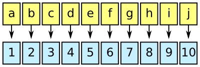

# Femtocode

## Introduction

Femtocode is a language and a system to support fast queries of structured data, such as high-energy physics data.

The goal is to replace the practice of copying and reducing a centrally produced dataset with direct queries on that dataset. Currently, high-energy physicists write programs to extract the attributes and data records of interest— personally managing the storage and versioning of that private copy— just to make plots from the subset in real time. Femtocode will allow users to make plots from the original dataset in real time, which may scale to petabytes.

Femtocode makes this possible by introducing a novel translation of query semantics into pure array operations, which strips away all unnecessary work at runtime. By dramatically reducing the computation time, the only bottleneck left is the data transfer, so caching is also heavily used to minimize the impact of similar queries.

This project is in an early stage of its development, though it is past the feasibility studies and basic implementation. End-to-end demonstrations will be possible by the end of April and usable prototypes will be available sometime in the summer of 2017.

## Installation

Don’t bother yet. See above.

# Project details

## Query language

Femtocode was inspired by fast SQL services that translate users’ requests into operations with the same meaning as the their queries, yet are much faster than naive interpretations of them. The ability to perform these translations is helped by the fact that SQL minimally constrains the computation: there are no “for” loops to specify an order of iteration, no mutable variables, etc. The language is fast _because_ it is high-level, rather than in spite of it.

At first, it would seem that SQL would be ideal for the first phase in every high-energy physics analysis: reducing huge sets of data points into distributions (histograms). But in their original form, these “data points” are structured collections of events containing jets containing tracks containing hits, all arbitrary-length lists of multi-field records. As a language, SQL does not express explode-operate-recombine tasks easily and most SQL implementations cannot evaluate them without expensive joins.

Femtocode generalizes the SELECT and WHERE statements of SQL by adding explode-operate-recombine semantics with a functional syntax. For instance,

    jets.map(j => j.tracks.filter(t => t.pt > 5).sum).max

would find the jet with the largest sum-of-pt for pt > 5 tracks within the jet. There would be no more than one result per event (zero if the event had no jets to start with). To do this in SQL would require assigning indexes, exploding, and then expensive joins to get one result per event. And yet it is typical of a physicist’s search through petabytes of data.

To suit this application, Femtocode is

   * **declarative:** order of expressions written is not necessarily the order evaluated,
   * **functional:** functions are objects, no side-effect generating loops, and variables are immutable,
   * **statically typed:** types must be understood before execution, though they are inferred from the input data types, rather than denoted explicitly,
   * **non-recursive:** no unbounded loops or infinite data types,
   * **vectorizable:** the above is sufficient to allow code translations that can pipeline and vectorize similar operations,
   * **no runtime errors:** and therefore no runtime error checking; all possible errors are caught by static analysis.

Furthermore, Femtocode’s syntax is as similar as possible to Python. Python expressions (not statements) are syntactically valid Femtocode, and Femtocode adds a more convenient lambda syntax (shown above).

### Explode functions

### Flat functions

### Recombine functions

## Fast execution

## Modular backends

## Server

