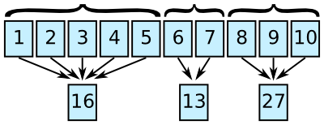

# Femtocode

Femtocode is a language and a system to support fast queries on structured data, such as high-energy physics data.

The goal of this project is to replace the practice of copying and reducing a centrally produced dataset with direct queries on that dataset. Currently, high-energy physicists write programs to extract the attributes and data records of interest— personally managing the storage and versioning of that private copy— just to make plots from the subset in real time. Femtocode will allow users to make plots from the original dataset in real time, which may be as large as petabytes.

Femtocode makes this possible by introducing a novel translation of query semantics into pure array operations, which strips away all unnecessary work at runtime. By dramatically reducing the computation time, the only bottleneck left is the data transfer, so caching is also heavily used to minimize the impact of repeated and similar queries.

This project is at an early stage of its development, though it is past the feasibility studies and basic implementation. End-to-end demonstrations will be possible by the end of April and usable prototypes will be available sometime in the summer of 2017.

## Installation

Don’t bother yet. See above.

# Project details

## Query language

Femtocode was inspired by fast SQL services that translate users’ requests into operations with the same meaning as the their queries, yet are much faster than naive interpretations of them. The ability to perform these translations is helped by the fact that SQL minimally constrains the computation: there are no “for” loops to specify an order of iteration, no mutable variables, etc. The language is fast _because_ it is high-level, rather than in spite of being high-level.

At first, it would seem that SQL would be ideal for the first phase of every high-energy physics analysis: reducing huge sets of data points into distributions (histograms). But in their original form, these “data points” are structured collections of events containing jets containing tracks containing hits, all arbitrary-length lists of multi-field records. As a language, SQL does not express explode-operate-recombine tasks easily and most SQL implementations cannot evaluate them without expensive joins.

Femtocode generalizes the SELECT and WHERE parts of SQL by adding explode-operate-recombine semantics in a functional syntax. For instance, given data structured as `events >> jets >> tracks`,

    jets.map(j => j.tracks.filter(t => t.pt > 5).sum).max

would find the jet with the largest sum-of-pt for pt > 5 tracks within the jet. There would be no more than one result per event (zero if the event had no jets to start with). To do this in SQL would require assigning indexes, exploding, and then expensive joins to get one result per event. And yet it is typical of a physicist’s search through petabytes of data.

### Language details

To suit this application, Femtocode is

   * **declarative:** order of expressions written is not necessarily the order evaluated,
   * **functional:** functions are objects, no side-effect generating loops, and variables are immutable,
   * **statically typed:** types must be understood before execution, though they are inferred from the input data types, rather than denoted explicitly,
   * **non-recursive:** no unbounded loops or infinite data types,
   * **vectorizable:** the above is sufficient to allow code translations that can pipeline and vectorize similar operations,
   * **no runtime errors:** and therefore no runtime error checking; all possible errors are caught by static analysis.

Furthermore, Femtocode’s syntax is as similar as possible to Python. Python expressions (not statements) are syntactically valid Femtocode, and Femtocode adds a more convenient lambda syntax (shown above).

Within this playground, any single-pass algorithm can be written that does not include unbounded loops: less powerful than Turing completeness but more powerful than strict SQL SELECT-WHERE. These algorithms can then be translated into sequences of operations on “shredded” data, data structures that have been flattened into featureless arrays. Rather than operating on data whose layout in memory resembles the conceptual task (e.g. all attributes of a jet together), the layout is organized for speed of access (e.g. all jet variable x in one array, jet variable y in another).

(See [this blog post](https://blog.twitter.com/2013/dremel-made-simple-with-parquet) for a description of shredding in Parquet. Femtocode uses a slightly different algorithm and applies all calculations to shredded data, not just storage.)

Femtocode translates into sequences of three basic kinds of operations: explode, flat, and combine.

### Explode operations

An array representing an attribute at one level of structure, such as one value per event, is brought in line with another array representing a different level of structure, such as one value per jet.

This can be accomplished by copying values from the first array or by moving two indexes at different rates.

### Flat operations

Two or more arrays have the same level of structure, and can therefore be operated upon element-by-element. This case corresponds to [Numpy’s “universal functions”](https://docs.scipy.org/doc/numpy/reference/ufuncs.html) or ufuncs.

Splitting loops appropriately would allow for automatic vectorization in this case, and any function adhering to the Numpy ufunc specification could be included in the language.

### Combine operations

An single array at one level of structure is reduced to a lower level of structure by computing a sum, maximum, minimum, etc.

Thus, the Femtocode example

    jets.map(j => j.tracks.filter(t => t.pt > cut).sum).max

would be translated into

   1. Take a `cut` variable (one per event) and associate each `t.pt` value to the appropriate one (explode).
   2. Mask `t.pt` values that are greater than `cut` (flat).
   3. Compute their sum, one per jet (combine).
   4. Find the maximal jet by this measure (another combine).

Columnar operations like these can be performed considerably faster than constructing jet objects containing variable-length track collections, executing the literal code, and then deleting these objects before moving on to the next event.

In our tests, columnar operations can be performed at a rate of billions per second, mostly sensitive to hardware memory bandwidth.

### Workflows

## Fast execution

## Modular backends

## Server

